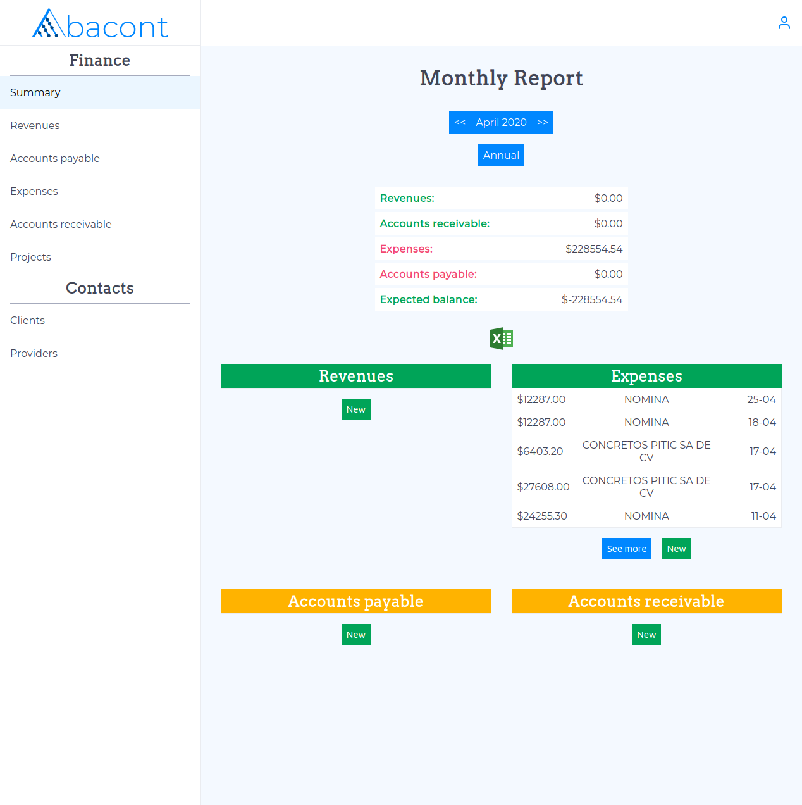
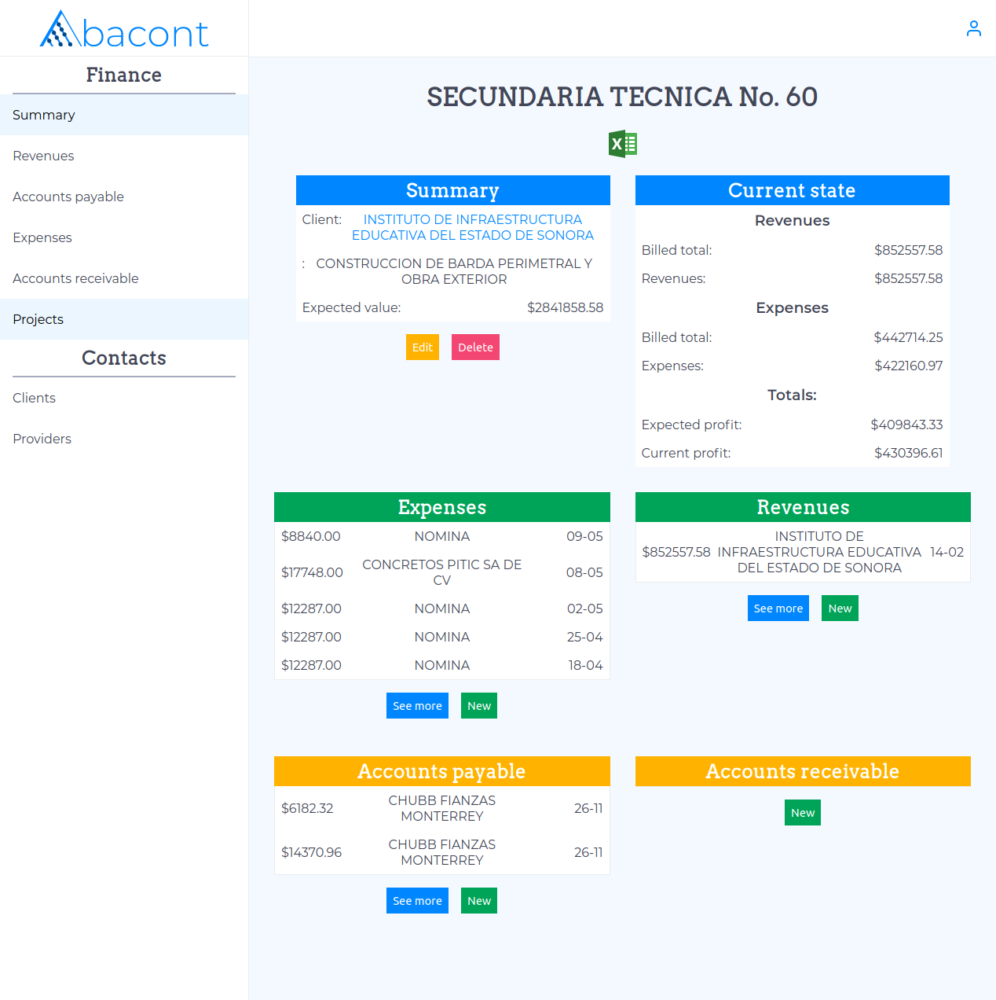
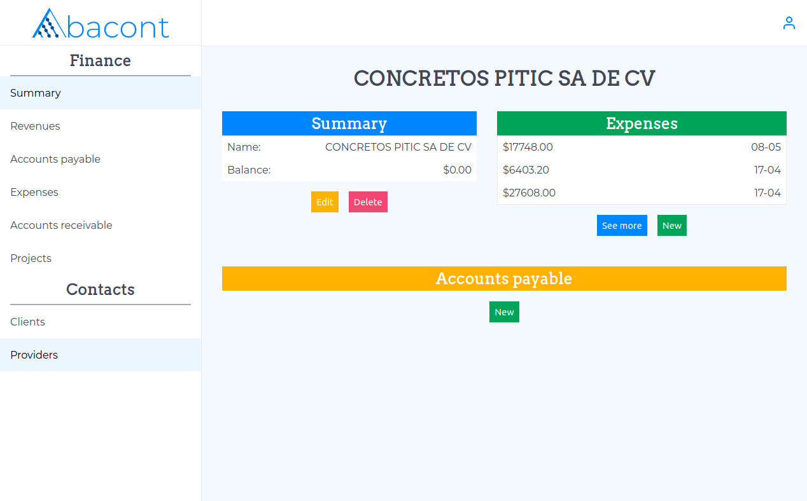

# Simple Accounting Softward
React front end for a simple accounting software.
## Main Features
- Manage multiple companies.
- Manage revenues, expenses, and accounts payable and receivable.
  - Revenues and expenses may be tied to accounts payable / receivable.
- Manage clients and providers.
  - View current debtors and debtees at a glance, as well as their balance.
- Group transactions into projects.
  - Glance and detailed view of current state of project vis-à-vis remaining payments, values, profits.
- Monthly and annual summaries
  - Can be exported into excel
- Teamwork
  - Team members can be invited and their privileges set so that they may contribute with any necessary data collection.
## Implementation
- React is used for the front end of the application, while the back end is handled by a custom Rails API ([see API code here](https://github.com/rafaelhrtd/abacont-backend))
- AXIOS calls are made to the API, which uses JWT and devise for authentication.
- Access privileges are managed in the back end through a CanCan implementation.
## Running Website
[Truss Problems](https://www.abacont.app/)
## Screenshots
Here are some examples of the different components of this application:
### Monthly Summary
A monthly summary of all monetary movements is shown. Can be switched to an annual report using the "annual" button.

### Project Summary
Relevant information to a created project is shown, including all monetary movements pertaining to it, as well as information on the expected value of the project given the current state.

### Provider / Client
Information relevant to a provider or client is given, including accounts payable (to the provider) and previous expenses relating to them. Similar information is available for clients.

